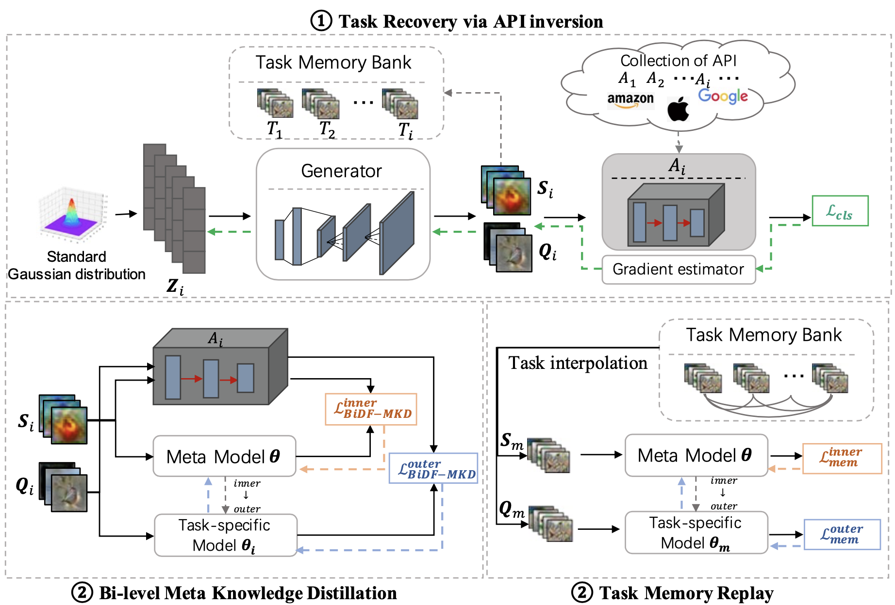

# Official Pytorch Implementation for "Learning to Learn from APIs: Black-Box Data-Free Meta-Learning" (ICML-2023)


## Paper & Framework:

For our paper accepted by [ICML-2023](https://icml.cc/Conferences/2023/CallForPapers), please refer to [camera-ready] (on-going) or [arxiv](https://arxiv.org/pdf/2305.18413.pdf) with the supplementary materials.




## Prerequisites:

* python == 3.8.15
* torch == 1.13.1

## Datasets & Pre-trained Modes:

**Datasets:**

* **CIFAR-FS:** 

  * Please manually download the CIFAR-FS dataset from [here](https://drive.google.com/file/d/19OemApI1Mc6b69xHh80NGRGTklLP961g/view?usp=sharing) to obtain "cifar100.zip".

  * Unzip ".zip". The directory structure is presented as follows:

    ```css
    cifar100
    ├─mete_train
    	├─apple (label_directory)
    		└─ ***.png (image_file)
    	...
    ├─mete_val
    	├─ ...
    		├─ ...
    └─mete_test
    	├─ ...
    		├─ ...
    ```

  * Place it in "./DFL2Ldata/".

* **Mini-Imagenet:** Please manually download it [here](https://drive.google.com/file/d/1X6YHK9NeWAwieodruib1rG5SqxhirbHC/view?usp=sharing). Unzip and then place it in "./DFL2Ldata/".

* **CUB:** Please manually download it [here](https://drive.google.com/file/d/1E0TPIwRUJAoDe7vb8fCcJWdzKv2I5k3O/view?usp=sharing). Unzip and then place it in "./DFL2Ldata/".

**Pre-trained models:**

- You can pre-train the models following the instructions below (Step 3).

## Training:

1. Make sure that the root directory is "./BiDf-MKD".

2. Prepare the dataset files.

   - For CIFAR-FS:

     ```shell
     python ./write_cifar100_filelist.py
     ```

     After running, you will obtain "meta_train.csv", "meta_val.csv", and "meta_test.csv" files under "./DFL2Ldata/cifar100/split/".

   - For MiniImageNet:
     ```shell
     python ./write_miniimagenet_filelist.py
     ```
     
     After running, you will obtain "meta_train.csv", "meta_val.csv", and "meta_test.csv" files under "./DFL2Ldata/Miniimagenet/split/".
     
   - For CUB:
     ```shell
     python ./write_CUB_filelist.py
     ```
     After running, you will obtain "meta_train.csv", "meta_val.csv", and "meta_test.csv" files under "./DFL2Ldata/CUB_200_2011/split/".
   
3. Prepare the pre-trained models.

    ```shell
    bash ./scriptskd/pretrain.sh
    ```
	
    Some options you may change:

    |     Option     |           Help            |
    | :------------: | :-----------------------: |
    |   --dataset    | cifar100/miniimagenet/cub |
    | --pre_backbone |  conv4/resnet10/resnet18  |

4. Meta training
   - For API-SS scenario:
     ```shell
      bash ./scriptskd/ss.sh
     ```
   - For API-SH scenario:
     ```shell
      bash ./scriptskd/sh.sh
     ```
   - For API-MH scenario:
     ```shell
      bash ./scriptskd/mh.sh
     ```
     
   
   Some options you may change:
   
   |     Option     |           Help            |
   | :------------: | :-----------------------: |
   |   --dataset    | cifar100/miniimagenet/cub for API-SS and API-SH, mix for API-MH |
   | --num_sup_train |  1 for 1-shot, 5 for 5-shot  |
   | --backbone |  conv4, the architecture of meta model  |
   | --pre_backbone |  conv4/resnet10/resnet18 for SS, mix for SH and MH  |
   | --q |  inference times of zero-order gradient estimation  |
   | --numsplit |  for parallel inference, reduce it for low memory cost  |
## Citation:

If you find this code is useful to your research, please consider to cite our paper.

```
@inproceedings{hu2023learning,
  title={Learning to Learn from APIs: Black-Box Data-Free Meta-Learning},
  author={Zixuan Hu, Li Shen, Zhenyi Wang, Baoyuan Wu, Chun Yuan, Dacheng Tao},
  booktitle={International Conference on Machine Learning},
  year={2023}
}
```

## Acknowledgements:

Some codes are inspired from [CMI](https://github.com/zju-vipa/CMI).

## Contact:

* **Zixuan Hu:**  huzixuan21@mails.tsinghua.edu.cn

